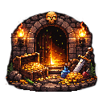

# 🏰 Escape Dungeon



**Escape Dungeon** is a 2D top-down dungeon crawler with roguelike elements, built with [libGDX](https://libgdx.com/) and Java 17.

Fight your way through procedurally populated dungeons, defeat enemies, collect gold, buy powerful weapons, and choose perks between levels to power up your run.

> Developed by **Lasariman Studios**

---

## ✨ Features

- **Dungeon Crawling** — Explore tile-based dungeon maps with real-time combat.
- **Roguelike Perks** — Choose from stat boosts and unique abilities between levels.
- **Weapon Arsenal** — Collect and equip a variety of swords.
- **Enemy Variety** — Battle Goblins, Ghosts, and RGB Ghosts with increasing difficulty.
- **Equipment & Shop** — Earn gold from enemies and spend it in the equipment screen to buy and equip new swords.
- **Persistent Progression** — Gold balance and owned weapons are saved between sessions.
- **Configurable Settings** — Window mode (windowed / borderless / fullscreen), FPS cap, VSync and fully rebindable controls.

## 🎮 Controls

| Action        | Default Key        |
|---------------|--------------------|
| Move Forward  | `W`                |
| Move Backward | `S`                |
| Move Left     | `A`                |
| Move Right    | `D`                |
| Attack        | Left Mouse Button  |
| Pause / Menu  | `Escape`           |

All controls can be rebound in the **Settings** screen.

## 🚀 Getting Started

### Prerequisites

- **Java 17** or later (a JDK, not just a JRE)
- **Gradle** is included via the wrapper — no separate installation needed

### Installation

For installation and packaging instructions, see **[INSTALL.md](INSTALL.md)**.

## 🏗️ Project Structure

```
escape-dungeon/
├── core/               # Shared game logic (entities, screens, weapons, world, etc.)
├── lwjgl3/             # Desktop launcher (LWJGL3 backend)
├── assets/             # Game assets (textures, sounds, levels, UI)
│   ├── levels/         # JSON map definitions
│   ├── sound/          # Sound effects
│   ├── textures/       # Sprite sheets and images
│   └── ui/             # UI elements, fonts, skin
├── gradle/             # Gradle wrapper files
├── docs/               # Documentation
├── final/              # Pre-built distribution packages
├── build.gradle        # Root build script
├── settings.gradle     # Gradle project structure
├── buildall.ps1        # PowerShell script to build all platform packages
└── EscapeDungen_setup.iss  # Inno Setup script for Windows installer
```

### Modules

| Module   | Description                                                                                                                                     |
|----------|-------------------------------------------------------------------------------------------------------------------------------------------------|
| `core`   | Application logic shared by all platforms — entities, screens, weapons, world simulation, roguelike systems, asset management, and persistence. |
| `lwjgl3` | Desktop launcher using LWJGL3. Handles window creation, input, and native libraries for Windows, Linux, and macOS.                              |

Each package includes a bundled Java 17 runtime — no separate Java installation is required for end users.

## 🗺️ Creating Custom Levels

Levels are defined as JSON files in `assets/levels/`. Example (`map_01.json`):

```json
{
	"background": "test.png",
	"width": 1920,
	"height": 1080,
	"startPosX": 0,
	"startPosY": 0,
	"walls": [
		{
			"texture": "wall.png",
			"width": 20,
			"height": 5,
			"posX": 30,
			"posY": 30
		}
	],
	"enemies": [
		{
			"enemyType": "goblin",
			"posX": 40,
			"posY": 60,
			"level": 1
		}
	]
}
```

To add a new level to the game's progression, add its filename (without `.json`) to the `LEVEL_SEQUENCE` array in `LevelScreen.java`.

## 🤝 Contributing

1. Fork the repository
2. Create a feature branch (`git checkout -b feature/my-feature`)
3. Commit your changes (`git commit -m "Add my feature"`)
4. Push to the branch (`git push origin feature/my-feature`)
5. Open a Pull Request

Please make sure the project compiles cleanly (`gradlew build`) before submitting.

## 📄 License

This project is licensed under the **GNU General Public License v3.0** — see the [LICENSE](LICENSE) file for details.

## 🔗 Links

- **Repository**: [https://github.com/R4ZXRN3T/escape-dungeon](https://github.com/R4ZXRN3T/escape-dungeon)
